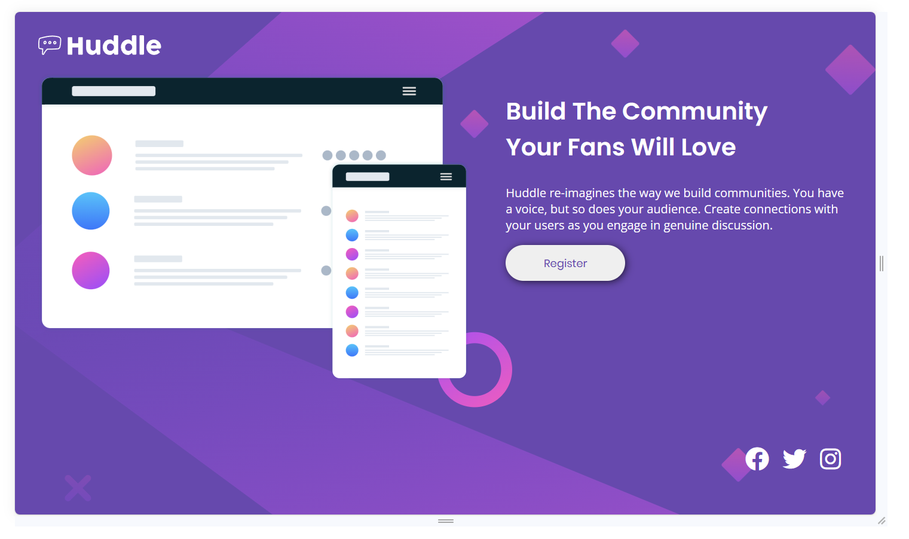

# Desafio de Layout Flex e Grid

Este repositório contém a solução para o desafio de criação de uma landing page simples utilizando as propriedades do Flexbox e Grid. O objetivo do desafio era aplicar os conceitos dessas propriedades para criar um layout responsivo e atraente.

## Sobre o Desafio

O desafio consistiu na criação de uma landing page que atendesse aos seguintes requisitos:

- Utilização do Flexbox e Grid para estruturar o layout.
- Responsividade para se adaptar a diferentes tamanhos de tela.
- Componentes básicos, como cabeçalho, seção de destaque e rodapé.
- Estilo atraente e consistente.

## Estrutura do Projeto

- **index.html**: O arquivo HTML principal contendo a estrutura da página.
- **src/**: Diretório principal contendo os subdiretórios **css/** e **images/**
- **styles.css**: O arquivo CSS contendo estilos para a página.
- **images/**: Diretório contendo as imagens utilizadas na página.
- **design/**: Diretório contendo capturas de tela do design final.

## Prints do Design Final

## Aprendizados

Durante a realização deste desafio, aprendi e pratiquei os seguintes conceitos:

- Criação de um layout responsivo com o auxílio do Grid.
- Organização e estruturação de uma página utilizando Flexbox.
- Adaptação de estilos para diferentes tamanhos de tela.
- Resolução de desafios comuns de design web.

## Melhorias Futuras

Há várias oportunidades de melhoria para este projeto, incluindo:

- Melhoria da responsividade.
- Refatoração do código CSS para torná-lo mais modular e reutilizável.

Sinta-se à vontade para contribuir com sugestões, reportar problemas ou fazer melhorias!

**Apreciem a simplicidade e elegância do layout!**